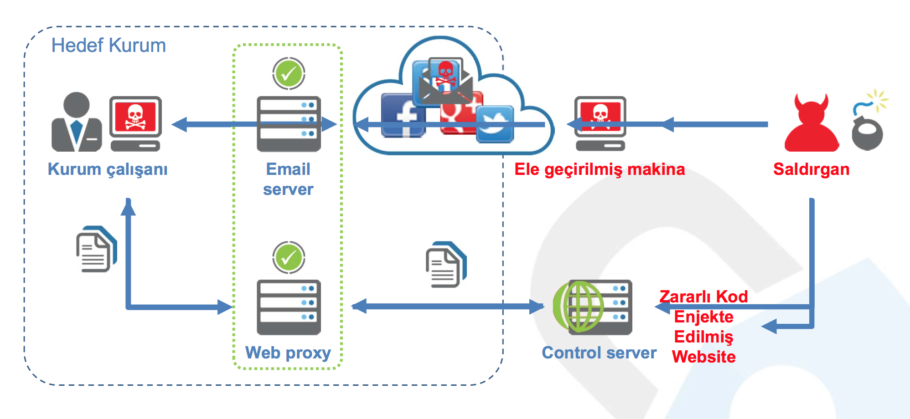

## BİLGİSAYAR SİSTEMLERİNE YAPILAN SALDIRILAR VE TÜRLERİ: BİR İNCELEME

> #### Güvenlik bir ölçümdür, özellik değildir.

### Hakkinda 

**Networks and security** cok genis capli bir konu alani oldugundan, konularimiz genelde neyi nasil yapacagin shekilinde degilde, bir shey yapmak icin izleyeceginiz yollar ne olmali onu bilgilendirma amacli kaleme alinmishtir.

### Icerik

* [Uyari](uyari.md)
* [Giris](giris.md)
  * alt ıcerık
  * onun da alti
* Ikinci
* Ucuncu
* [Arastirilacak kaynak listesi](liste.md)

#### Extra

* [Hacker Terimleri](extra/hacker.md)

### Hazirlayan

* **[A]** Hangeldi Atayev
* **[C]** Kakacan Şagılıcov
* **[B]** 

Uygulama gelistirme odevi olarak LMYO Ozcan hocaya teslim edilmishtir falan filan yazi  
Sayawan © 2015