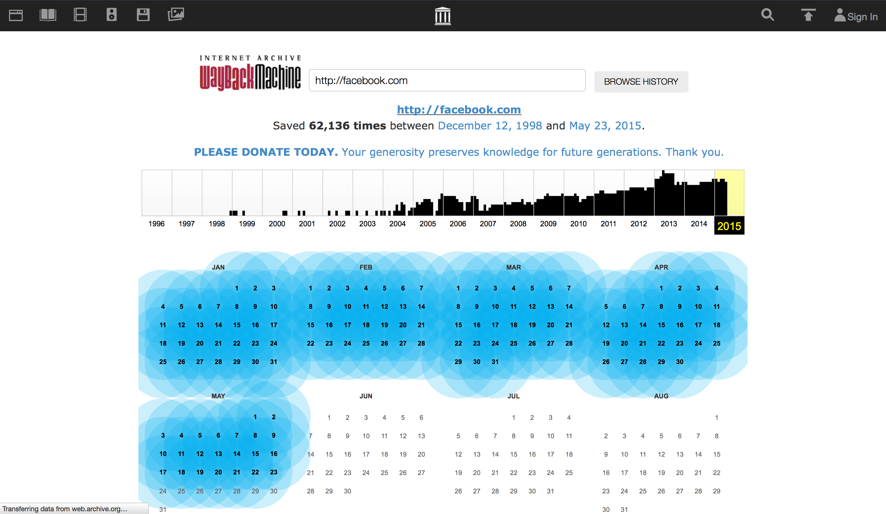
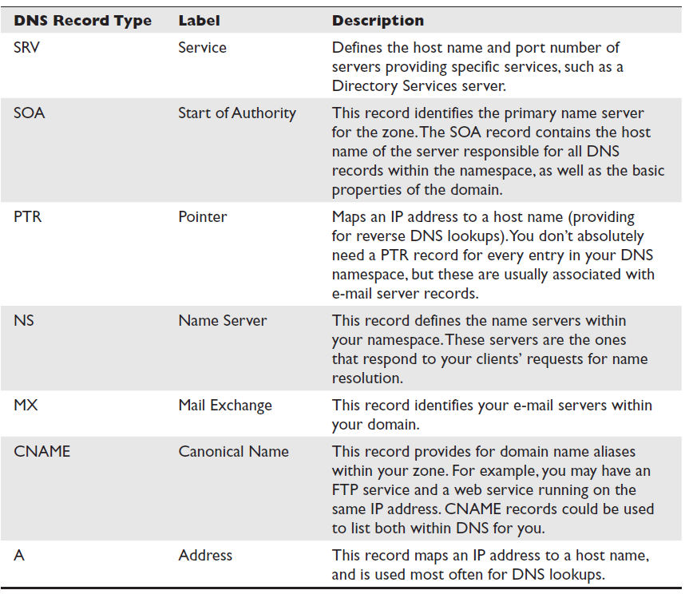
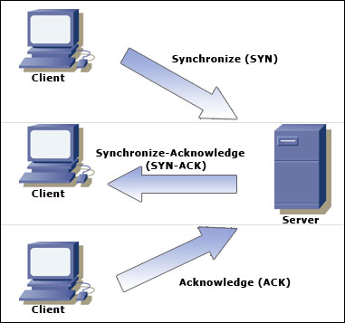
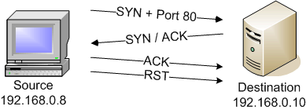
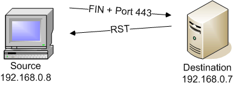
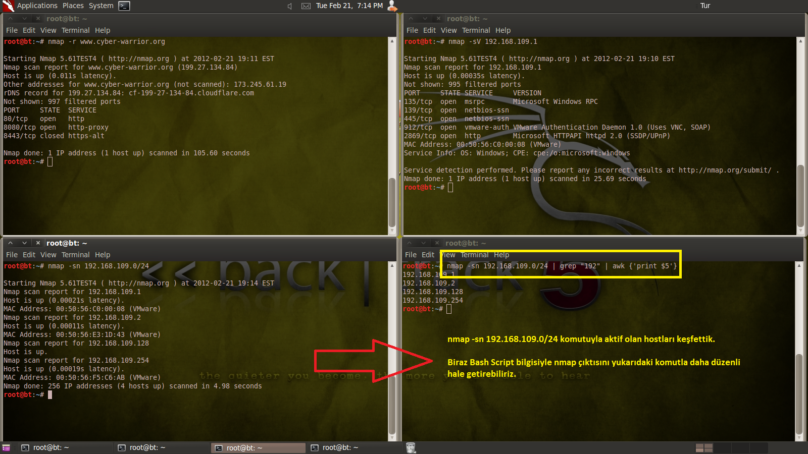

### Bilgi toplama

Güvenlik testlerinde bilgi toplama en önemli adımdır. Yeterli düzeyde toplanmayan veri istenilen sonuçları çıkaramaz. Bilgi toplama esnasında bu gerekli mi değil mi diye sorulmadan alınabilecek tüm bilgiler alınmalı ve bu bilgiler sonraki aşamalarda kullanılmak üzere sınıflandırılmalıdır. Sızma işleminin başarısı bu evreye bağlıdır. Kişisel olarak bu evrenin en uzun sürmesi kanaatindeyim. Çünkü hedef hakkında ne kadar fazla bilgiye erişilirse sızma işleminde o kadar fazla farklı yöntem denebilir (Oltalama, port tarama, pdf vb.)

__Bilgi Toplama Yöntemleri:__
Bilgi toplama; hedef sistemle doğrudan iletişime geçerek ve hedef sistemden bağımsız olmak üzere iki türdür.
1. Pasif Bilgi Toplama
2. Aktif Bilgi Toplama

#### 1. Pasif Bilgi Toplama
___
* Hedef sistem ile doğrudan iletişime geçilmez, herhangi bir iz bırakmadan internetin imkanları kullanılarak yapılır.
* Mesela whois sorguları ile şirketin ip aralığı, sorumlu yöneticisi bulunabilir. DNS sorguları ile mail, ftp ve benzeri servislerin hangi ip adreslerinde çalıştığı, ip adresleri ve işletim sistemi bilgilerini hedefle herhangi bir iletişim kurmadan alabiliriz.
* Basit bir whois sorgusundan şu bilgiler edinilebilir; ilgili birimde çalışanların telefon numaraları, e- posta adresleri , şirketin e-posta adresi kullanım profili(isim.soyisim@sirket.com gibi) vb.

##### IP Adresleri ve Domain Adları Hakkında Bilgi Edinme

* Tüm dünyada ip adresi ve domain ismi dağıtımı tek bir merkezden kontrol edilir. Bu merkez __ICANN__ (Internet Corporation for Assigned Named and Numbers) adlı bir kurumdur.
* ICANN IP adresleri ve domain isimlerinin dağıtımını aşağıdaki gibi düzenlemiştir.
    * IP Adresleri : RIR (Regional Internet Registrars) lar aracılığı ile.
    * Domain isimleri : özel şirketler aracılığı ile IP Adreslerinin bulunduğu bölgeye göre farklı RIR’lardan sorgulanabilir. Dünya üzerinde ip adreslerinin bilgisini tutan 5 farklı RIR vardır. Bunlar:


##### Netcraft

* Netcraft, işletim sistemi, kernel versiyonu ve web sunucu olarak çalışan yazılıma ait detaylı bilgilerin yanı sıra sistemin uptime bilgisini gösterebilen bir sayfadır.

* Sorgulanan sisteme ait geçmiş bilgiler(hangi işletim sistemi vs) de yer almaktadır.

__Netcraft nasıl çalışır?__
Netcraft hedef sistemin yazılım bilgilerini belirlemek için _httprint_ ile çeşitli sorgular yapar ve gelen cevaplara göre bir tahminde bulunur. (Burada yapılan hatalı bir istekdir ve dönen hata cevaplarından web sunucu yazılımı belirlenir).


##### Whois Arama

Bir IP adresine ait bilgilere en kısa yoldan whois sorgusu ile erişilebilir.

bulbsecurity.com için whois sonuçları
```ShellSession
root@kali:~# whois bulbsecurity.com
Registered through: GoDaddy.com, LLC (http://www.godaddy.com)
    Domain Name: BULBSECURITY.COM
        Created on: 21-Dec-11
        Expires on: 21-Dec-12
        Last Updated on: 21-Dec-11

Registrant:
Domains By Proxy, LLC
DomainsByProxy.com
14747 N Northsight Blvd Suite 111, PMB 309 
Scottsdale, Arizona 85260
United States

Technical Contact:
    Private, Registration BULBSECURITY.COM@domainsbyproxy.com Domains By Proxy, LLC
    DomainsByProxy.com
    14747 N Northsight Blvd Suite 111, PMB 309
    Scottsdale, Arizona 85260
    United States
    (480) 624-2599 Fax -- (480) 624-2598
    
Domain servers in listed order: 
NS65.DOMAINCONTROL.COM
NS66.DOMAINCONTROL.COM
```

Bu domain `private` yani özel olduğundan, burda asıl kaydeden kullanıcı bilgilerine erişemiyoruz. Başka herhangi bir domain ismi seçerek deneyebiliriz. Mesele ben kendi aldığım domaine baktım, eski telefon numara kadar bilgiler saklıydı :)

whois servisi TCP/43 portundan çalışmaktadır ve çoğu sistemde bu port dışarıya doğru açık değildir. Bu sebeple whois hizmetini genelde whois proxyler üzerinden alırız. Whois proxyler basit birer web sayfasıdır ve kullanıcıdan aldığı sorgulamaları whois sunuculara göndererek sonucu kullanıcıya gösterir.

##### Web Sayfalarının Geçmişini İzleme

Archive.org 1996’dan beri tüm interneti kayıt altına alan bir yapıdır. Buradan hedef sistemin önceki kaydedilmiş bilgilerine erişim sağlanabilir.

Mesela _facebook.com_ sorguladığınızda bu domaine ait hangi devirlerde arşiv alınmış bilgisi ve bu dönemlere ait sitenin görünümünü elde edilebilir.




##### DNS Keşfi

DNS Protokolü internetin temel yapıtaşıdır. Genel olarak www hizmetlerinde ve e-posta servislerinde kritik rol oynar. Düzgün yapılandırılmamış bir DNS sunucu dışarıya oldukça fazla bilgi verebilir.

__DNS sorgu tipleri__


###### Nslookup

Nslookup (Windows/Linux) ve Linux sistemler için dig komutu ile her tür dns sorgulama işlemi yapılabilir.

```ShellSession
root@Kali:~# nslookup www.bulbsecurity.com 
Server: 75.75.75.75
Address: 75.75.75.75#53

Non-authoritative answer:
www.bulbsecurity.com canonical name = bulbsecurity.com. 
Name:       bulbsecurity.com
Address:    50.63.212.1
```

Gördüğnüz gibi www.bulbsecurity.com sitesinin IP adresini verdi. Şimdi, istersek bir sitenin _mail server_'ini yani _MX_ kaydını da bulabiliriz; 

```ShellSession
root@kali:~# nslookup
> set type=mx
> bulbsecurity.com 
Server: 75.75.75.75 
Address: 75.75.75.75#53

Non-authoritative answer:
bulbsecurity.com    mail exchanger = 40 ASPMX2.GOOGLEMAIL.com.
bulbsecurity.com    mail exchanger = 20 ALT1.ASPMX.L.GOOGLE.com.
bulbsecurity.com    mail exchanger = 50 ASPMX3.GOOGLEMAIL.com.
bulbsecurity.com    mail exchanger = 30 ALT2.ASPMX.L.GOOGLE.com.
bulbsecurity.com    mail exchanger = 10 ASPMX.L.GOOGLE.com.
```

Yukarda verilen sonuçlara bakarak, diyebiliriz ki _bulbsecurity.com_ sitesi email sunucusu olarak Google Mail kullanmaktadır.

###### Host

DNS sorgu tiplerinden bir diğeri de __Host__. Bu komuta domain ismini girerek sunucu isimlerini öğrenebiliriz. Aşağıdaki örnekte `host -t ns domain` bize zoneedit.com sitesinin DNS sunucularını gösterecektir.

```ShellSession
root@kali:~# host -t ns zoneedit.com 
zoneedit.com name server ns4.zoneedit.com. 
zoneedit.com name server ns3.zoneedit.com. --snip--
```

###### Bölge Aktarımı (Zone Transfers)

DNS’in yapısı gereği ikincil dns sunucular kendilerinde tanımlı birincil dns sunucunun verilerini alırlar ve bunlara göre gelen istekleri cevaplarlar. Burada transfer edilen veri tamamen bizim domain kayıtlarımıza aittir ve yabancı gözlerden uzak tutulmalıdır. Bunu da master DNS sunucularda sadece yetkili ip adreslerine zone transfer izni vererek yapılır.

Sisteme sızmak isteyen birinin yapacağı keşiflerden biri de domain sunucunuzdan zone transferi yapmaktır.

```ShellSession
root@kali:~# host -l zoneedit.com ns2.zoneedit.com 
Using domain server:
Name: ns2.zoneedit.com
Address: 69.72.158.226#53
Aliases:

zoneedit.com name server ns4.zoneedit.com. 
zoneedit.com name server ns3.zoneedit.com. 
zoneedit.com name server ns15.zoneedit.com. 
zoneedit.com name server ns8.zoneedit.com. 
zoneedit.com name server ns2.zoneedit.com. 
zoneedit.com has address 64.85.73.107 
www1.zoneedit.com has address 64.85.73.41 dynamic.zoneedit.com has address 64.85.73.112 
bounce.zoneedit.com has address 64.85.73.100 
--snip--
mail2.zoneedit.com has address 67.15.232.182 
--snip--
```

Sonuçlara baktığımızda bizim işimize yarayabilecek _zoneedit.com_ için bazı DNS girişleri var, sızmak için taramalarımızı burdan başlatabiliriz. Mesela _mail.zoneedit.com_ büyük ihtimalle mail sunucusudur, o yüzden biz güvenlik açığı olabilecek _25 (Simple Mail Transfer Protocal)_ ve _110 (POP3)_ gibi sıradan email port'larına sızmaya çalışabiliriz. Web mail sunucusuna giriş yapılabilecek mail adresi veya kullanıcı ismi buldukmu, doğru yolda olduğumuzdur; son olarak ta şifreyi tahmin etmeye çalışabiliriz.

##### Email Adres Arama

Bir domaine ait internette dolaşan (arama motroları vasıtası ile bulunabilecek) e-posta hesaplarini toptan görmek icin arama motorları ile ugraşmaniza gerek yok, Google ve MSN Search’u bizim için arayıp belirlediğimiz kriterlere göre mailleri bulan TheHarvester’i kullanabilirsiniz.

```ShellSession
root@kali:~# theharvester -d bulbsecurity.com -l 500 -b all

*******************************************************************
*                                                                 *
* | |_| |__   ___    /\  /\__ _ _ ____   _____  ___| |_ ___ _ __  *
* | __| '_ \ / _ \  / /_/ / _` | '__\ \ / / _ \/ __| __/ _ \ '__| *
* | |_| | | |  __/ / __  / (_| | |   \ V /  __/\__ \ ||  __/ |    *
*  \__|_| |_|\___| \/ /_/ \__,_|_|    \_/ \___||___/\__\___|_|    *
*                                                                 *
* TheHarvester Ver. 2.5                                           *
* Coded by Christian Martorella                                   *
* Edge-Security Research                                          *
* cmartorella@edge-security.com                                   *
*******************************************************************

Full harvest..
[-] Searching in Google..
    Searching 0 results...
    Searching 100 results...
    Searching 200 results...
    Searching 300 results...
--snip--

 [+] Emails found:
------------------
georgia@bulbsecurity.com

[+] Hosts found in search engines:
------------------------------------
50.63.212.1:www.bulbsecurity.com
--snip--
```

##### Maltego

* Maltego, bildiğimiz tüm klasik bilgi toplama yöntemlerini birleştirerek merkezi bir yerden kontrol ve raporlama imkanı sunar. Bu sebeple yeni nesil (ikinci nesil) bilgi toplama aracı olarak sınıflandırılır.

* Maltego dört ana ekrandan oluşur. Bu ekranlar arama kriterlerin, ana sorgu sayfası, sorgu özellikleri ve üst menüdür.

* Maltego'nun __community__ ve __commercial__ olmak üzere iki yayını vardır. Topluluk versiyonun tek farkı, sınırlı bir arama sonuçları vermesindedir.

* Başlatmak için terminalde `maltego` yazalım, grafiksel arayüzü açılacaktır. İlk açtığımızda `Welcom to Maltego` ekranıyla buluşacağız, ve burda bizden yeni bir üye olup giriş yapmamız istenecektir.  
    Mailinize doğrulama kodu gönderilecektir, spam kutusuna bakmayı da unutmayın.

* Giriş yaptıktan sonra __Open a blank graph and let me play around__ seçerek __Finish__ basalım.

![maltego1]

Sol tarafta __Palette__ panelini bir seçelim, ordan neler hakkında bilgi alabileceğimizi görebiliriz. Biz şimdi örnek olarak, __Infrastructure__ gelerek ordan __Domain__ seçelim ve sürükleyerek yeni açtımız __New Graph__ üstüne bırakalım. Varsayılan değer _paterva.com_'dur, değiştirmek için çift tıklayarak aramak istediğimiz adresi giriyoruz. Ben _bulbsecurity.com_ girdim.

![maltego2]

Domain'imizi ayarladıktan sonra _transform_ (maltego dilinde aramalar) çalıştırabiliriz. Şimdi biz yukarda manuel yoldan yaptığımız gibi _MX_ bilgilerini ögrenmeye çalışalım. Onun için __All Transforms > To DNS Name - MX (mail server)__ seçelim. Sonuç olarak göreceğiz ki, Maltego bu sitenin Google Mail sunucusunu kullandığını gösterecek:

![maltego3]

sonuçlarımız aynı

![maltego4]

Google Mail sunucularına sızmaya çalışmak pentest denemelerinin dışında kalacaktır. Ama genede _bulbsecurity.com_ için bazı bilgiler edinebiliriz. __Infrastructure > Website > All Transforms > ToServerTechnologiesWebsite__

![maltego5]

[maltego1]: ../resim/bilgi/maltego1.png
[maltego2]: ../resim/bilgi/maltego2.png
[maltego3]: ../resim/bilgi/maltego3.png
[maltego4]: ../resim/bilgi/maltego4.png
[maltego5]: ../resim/bilgi/maltego5.png

#### Nmap

Nmap, bilgisayar ağları uzmanı Gordon Lyon (Fyodor) tarafından C/C++ ve Python programlama dilleri kullanılarak geliştirilmiş bir güvenlik tarayıcısıdır. Taranan ağın haritasını çıkarabilir ve ağ makinalarında çalışan servislerin durumlarını, işletim sistemlerini, portların durumlarını gözlemleyebilir.

Nmap kullanarak ağa bağlı herhangi bir bilgisayarın işletim sistemi, çalışan fiziksel aygıt tipleri, çalışma süresi, yazılımların hangi servisleri kullandığı, yazılımların sürüm numaraları, bilgisayarın güvenlik duvarına sahip olup olmadığı, ağ kartının üreticisinin adı gibi bilgiler öğrenilebilmektedir.

##### Nmap Komutları

* nmap -sS 192.168.1.1 = TCP SYN Scan
* nmap -sT 192.168.1.1 = TCP Connect Scan
* nmap -sF 192.168.1.1 = FIN Scan
* nmap -sX 192.168.1.1 = Xmas Tree Scan
* nmap -sN 192.168.1.1 = Null Scan
* nmap -sP 192.168.1.1 = Ping Scan
* nmap -sV 192.168.1.1 = Version Detection
* nmap -sU 192.168.1.1 = UDP Scan
* nmap -sO 192.168.1.1 = IP Protocol Scan
* nmap -sA 192.168.1.1 = ACK Scan
* nmap -sW 192.168.1.1 = Window Scan
* nmap -sR 192.168.1.1 = RPC Scan
* nmap -sL 192.168.1.1 = List Scan

##### Nmap Tarama Çeşitleri

1. TCP SYN Scan
Kaynak bilgisayarın hedef bilgisayara TCP SYN bayraklı paket gönderilerek yapılan bir tarama şeklidir.Eğer taranan portlar kapalı ise hedef makinadan kaynak makinaya RST + ACK bayraklı paket döndürülür.
Eğer taranan portlar açık ise SYN + ACK bayraklı paket döndürülür.
Daha sonra kaynak bilgisayarda RST bayraklı paket göndererek bağlantı kopar.
Bu taramayı kullanmak için;  
    `nmap -sS 192.168.1.1` komutu yeterlidir. 
    `-v` parametresini ekleyerek komut çıktısını daha düzenli hale getirebilirsiniz.  
    

2. TCP Connect Scan
Tarama kapalı portlara yapıldığı zaman RST + ACK paketi döndürülür.
Tarama açık portlara yapıldığı zaman hedep bilgisayarın göndereceği SYN + ACK bayraklı paketi,kaynak bilgisayar ACK bayraklı paket göndererek cevaplar ve bağlantı sağlanır.  
    Bu taramayı kullanmak için;  
    `nmap -sT 192.168.1.1` komutu yeterlidir.  
    

3. FIN Scan
Hedef makinaya TCP bağlantı isteği olmadan gönderilen paketle tarama yapılır. Eğer taranan portlar kapalı ise geriye RST + ACK paketi dönecektir. Eğer açık ise hedef bilgisayardan bir tepki gelmeyecektir.  
    Bu taramayı kullanmak için;  
    `nmap -sF 192.168.1.1` komutu yeterlidir.  
    

4. Xmas Tree Scan
Kaynak bilgisayarın TCP paketine URG,PSH ve FIN bayraklı bir set halinde yapılan taramadır. Eğer taranan portlar kapalı ise geriye RST + ACK paketi dönecektir. Eğer taranan portlar açık ise hedef bilgisayardan tepki gelmeyecektir.  
    Bu taramayı kullanmak için;  
    `nmap –sX 192.168.1.1` komutu yeterli olacaktır. 
    
Örnek Verdiğimiz komutların çıktıları bu şekilde olacaktır:



[Kaynak](http://www.cyber-warrior.org/Forum/temel-nmap-kullanimi-lojistik-all-star_456253,0.cwx)


##### DAHA FAZLASI İÇİN:

* [Nmap Wikipedia](http://tr.wikipedia.org/wiki/Nmap)

* [Nmap Kullanım Kitapçığı](http://www.slideshare.net/bgasecurity/nmap-kullanm-kitap-27487242)

* [Güvenlik Testlerinde Bilgi Toplama](http://www.slideshare.net/bgasecurity/gvenlik-testlerinde-bilgi-toplama)