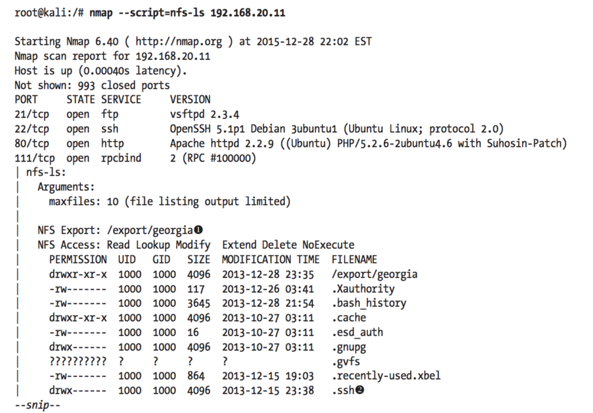

### Güvenlik Açıkları bulma

#### Nessus

Nessus, Linux camiasında sıkça kullanılan, kapsamlı bir güvenlik açığı tarama yazılımıdır. Kişisel ve her tür kurumsal olmayan kullanım için ücretsizdir. Genel amacı, bilgisayar sistemlerinde ve bilgisayar ağlarında potansiyel güvenlik açıklarını tespit etmektir.

Nessus bir port tarama yazılımından çok daha üstün özelliklere sahiptir. Nmap benzeri yazılımlar yalnızca karşıdaki sunucu ya da makine hakkında işletim sistemi, açık port bilgileri verebiliyorken Nessus, servislerdeki açıkları eklentilerinin güncelliğine bağlı olarak test edebilir. Çalışma prensibi istemci/sunucu biçimini kullanır ve test edilecek sistemde Nessus sunucu yazılımının açık olması daha derinlemesine test ve analiz imkânı sunar. [Wikipedia](http://tr.wikipedia.org/wiki/Nessus)

Nessus Kali'de hazır kurulu olarak gelmemektedir, kurulumunu bu konuda anlatmıştık. XXX. Yapacağımız örnekleri bedava sürümü olan Nessus Home ile devam edebiliriz. Bu sürümü 16 IP adresi taramayla sınırlıdır. Nessus'u başlatmadan Nessus daemon uygulamasını çalıştırmamız lazım:

```ShellSession
root@kali:~# service nessusd start
```

Servisi başlattıktan sonra https://kali:8834 adresine gidelim, ve önceki bölümlerde girmiş olduğumuz kullanıcı adı ve parola ile giriş yapalım. 

![nessus1]

##### Nessus Policies

Nessus web arayüzünün ekranın üst kısmında birkaç sekmesi vardır. _Policies_ sekmesi ile başlayalım. _Nessus Policies_ güvenlik açığı aramalarımızda  çalıştırdığımız port tarama, açık kontrolü gibi işlemlerin saklandığı ayar dosyası hizmetini görmektedir.

![nessus2]

Yeni bir _policy_ oluşturmak için sağ kısımda bulunan __New Policy__ tıklanır. Karşımıza çıkacak yardımcı sihirbazı bizim amacımıza göre _policy_ oluşturmamıza yardımcı olacaktır. Basit bir örnek olarak __Basic Network Scan__ seçelim.

![nessus3]

Şimdi bizden _policy_ hakkında isim, açıklama, erişilebilirlik gibi bazı temel sorular sorulacaktır. Tamamlayınca, __Next__

![nessus4]

Nessus sürekli güncellenmekte olan bir araçtır, zamanla tasarım vb değişiklik gösterebilir. Solda bazı ayarlar vardır; Mesela, eğer kimlik bilgileriniz varsa, Nessus hostlar ile kimlik doğrulamasını yapacak ve güvenlik açığı için arama yapacaktır. Bu özellik genelde dahili olarak ağ güvenligi tespit etmek için kullanılır. Şimdilik, boş bırakalım ve __Save__

![nessus5]

Sonra oluşturduğumuz _policy_ _Policy tab_ altında sıralanmış olduğunu göreceksiniz.

![nessus6]

##### Nessus ile Tarama

Şimdi ise, _Scans_ sekmesine geçelim ve hedef makinelerimize karşı Nessus'u çalıştıralım. __Scans > New Scan > User sekmesi > cansupolicy (son oluşturduğumuz policy)__ basalım 

![nessus7]

ve resimdeki gibi bilgileri dolduralım. 
* Name: yaptığımız aramanın ismi
* Policy: oluşturduğumuz _policy_'lardan bir tanesini seçiyoruz
* Targets: taranacak hedef makineleri

![nessus8]

Nessus olabildiğine fazla bilgi ve hata bulabilmek için hedefimize karşı prob serisini çalıştıracaktır. Çalışan taramalar _Scans_ sekmesinde görüntülenecektir.

![nessus9]

Tarama bitiminde, sonuçlarına bakalım.

![nessus10]

Gördüğünüz gibi, Nessus Windows XP ve Ubuntu sistemlerinde kritik sorunlar buldu, Windows 7 sisteminde ise sadece bilgi amaçlı veri bulabildi. Ayrıntılı bilgi için _host_'lardan bir tanesini seçelim. Aşağıda Windows XP için ayrıntılı olarak verilmiştir.

![nessus11]

Açıkları tarama araçları hakkında ne derseniz deyin, ama Nessus kadar az çaba gerektiren hem-de iyi ve hızlı sonuçlar alınabilen başka bir araç zor bulunur. Mesela, Nessus'un sonuçlarına bakarsak hedefimizdeki Windows XP sisteminin önceden de bahsettiğimiz MS08-067 yaması eksik olduğunu belitiyor. Ve görülüyor ki diğer Microsoft yamalarının eksikliği SMB sunucusunu etkilemektedir.

![nessus12]

Hangi açık sızmak için daha elverişli? Nessus'un verdiği çıktılara bakarsak, bir açık hakkında kullanabileceğimiz sızma yöntemleri hakkında da bilgi vermektedir. Mesela, MS08-067 çıktısına baktığımızda Metasploit ve buna benzer Core Impact, Canvas araçları ile sızma yapılabileceğimizi göstermekte.

Nessus taraması tamamlanınca, _Export_ butonuna tıklayarak çıktısını alabiliriz. Başlıca PDF, HTML, XML, CSV dosyalarına kaydedilebilir.

![nessus13]

__Güvenlik açıklarının araştırılması__

Nessus'un çıkartmış olduğu açıklar hakkında bilginin yeterli olmadığını düşünüyorsanız, ilk yapacağımız şey Google'da aratmak olacaktır. Yardımcı kelime olarak:

* Common Vulnerabilities and Exposures (CVE) system
* Microsoft'un yama numarasından
* `ms08-067 site:securityfocus.com`

gibi arama kriterlerini girebilir. Yanı sıra bu linklere de bakılabilir:

* http://www.securityfocus.com
* http://www.packetstormsecurity.org/
* http://www.exploit-db.org/
* http://www.cve.mitre.org/

İnternette genel güvenlik açıkları konusunda baya bir bilgi vardır. Zamanla o açıkları kullanarak nasıl saldırı yapılacağına dair bilgilerle, exploit'ler de karşılaşılacaktır. Dikkat etmemiz gereken her yöntem bizim işimize yaramayabilir. Kötü amaçlı olanları da bulunmaktadır, saldırı yapayım derken exploit geliştiricisinin gizli botnet'i olabiliriz.

[nessus1]: ../resim/nessus/1.png
[nessus2]: ../resim/nessus/2.png
[nessus3]: ../resim/nessus/3.png
[nessus4]: ../resim/nessus/4.png
[nessus5]: ../resim/nessus/5.png
[nessus6]: ../resim/nessus/6.png
[nessus7]: ../resim/nessus/7.png
[nessus8]: ../resim/nessus/8.png
[nessus9]: ../resim/nessus/9.png
[nessus10]: ../resim/nessus/10.png
[nessus11]: ../resim/nessus/11.png
[nessus12]: ../resim/nessus/12.png
[nessus13]: ../resim/nessus/13.png

#### Nmap Betik Motoru

__NSE (Nmap scripting engine)__, Nmap'in en güçlü ve kullanışlı özelliklerinden birisidir. _NSE_'yi; normal Nmap komutlarıyla yapılamayan ya da yapılması çok zor olan işlemlerin daha kolay bir şekilde yapılmasının sağlandığı bir betikler bütünü olarak tarif edebiliriz. Nmap ile birlikte birçok betik kütüphanesi hazır olarak gelmektedir. Fakat NSE aynı zamanda kullanıcıların ihtiyaç duydukları betikleri kendilerinin de yazabilmelerini ve bunları paylaşabilmelerini de sağlar. NSE'de yer alan betikler aynı anda paralel olarak da çalıştırılabilirler.

NSE kullanarak temel olarak yapılabilecekler aşağıda listelenmiştir:

1. Ağ keşifleri: Hedef etki alanlarının (domain) whois veri tabanı sorguları yapılabilir. Hedef sistemlerin SNMP sorguları yapılabilir ve mevcut NFS/SMB/RPC paylaşım ve servisleri listelenebilir.

2. Karmaşık versiyon tespiti Normal Nmap komutlarıyla hedef sistemlerin versiyonları belirlenebilmektedir. NSE ile hedef sistemlerin versiyonları çok daha ayrıntılı bir şekilde tespit edilebilmektedir.

3. Zafiyet (vulnerability) tespiti Normal Nmap komutlarıyla hedef sistemlerin zafiyetleri tam anlamıyla tespit edilememektedir. NSE ile bu zafiyetler daha kolayca belirlenebilmektedir. Nmap ile hazır gelen birçok zafiyet tespit betiği bulunmaktadır. Fakat Nmap'in temel işlevinin bir zafiyet tarayıcısı olmadığının bilinmesi gerekir.

4. Arka kapı (backdoor) tespiti NSE bazı arka kapı programlarını da tespit edebilmektedir.

5.  Zafiyet sömürmmesi (Vulnerability exploitation) NSE ile sadece hedef sistemlerin zafiyetleri tespit edilmekle kalmayıp bu zafiyetlerin bazıları kullanılarak hedef sistemlere sızılması da mümkün olmaktadır. Fakat Nmap'in temel amacı Metasploit gibi bir zafiyet sömürü programına dönüşmek değildir. Buna rağmen NSE ile hedef sistemlerdeki bazı zafiyetlerin sömürülmesi de mümkündür.

Kali'miz içermiş olduğu NSE scriptleri _/usr/share/nmap/scripts_ dosyasında bulunur. Onlara bir bakalım:

```ShellSession
root@kali:~# cd /usr/share/nmap/scripts 
root@kali:/usr/local/share/nmap/scripts# ls
acarsd-info.nse             ip-geolocation-geobytes.nse
address-info.nse            ip-geolocation-geoplugin.nse
afp-brute.nse               ip-geolocation-ipinfodb.nse
afp-ls.nse                  ip-geolocation-maxmind.nse
--snip--
```

Belirli bir script veya kategori hakkında bilgi almak için `--script-help` yazılır. Mesela, _default_ kategorisinde bulunan tüm scriptleri listelemek için `nmap --script-help default`. Güvenirlik, scriptin güvenliği, hedef makineye zarar vermemesi gibi birçok faktör o script'in _default_ kategorisinde olup olmayacağını bilerler.

```ShellSession
root@kali:~# nmap --script-help default
Starting Nmap 6.40 ( http://nmap.org ) at 2015-07-16 14:43 EDT 
--snip--
ftp-anon
Categories: default auth safe http://nmap.org/nsedoc/scripts/ftp-anon.html

    Checks if an FTP server allows anonymous logins.
    If anonymous is allowed, gets a directory listing of the root directory and highlights writeable files.
--snip--
```

Port taramalarında scriptimiz `-sC` ile kullanıldığında sadece _default_ kategorisindeki komutları çalıştırır. Şimdi 192.168.2.10 ile 192.168.2.12 portlar arası tarama yapalım, hatırlıyorsanız burda Windows XP sanal makinemiz çalışıyordu.

```ShellSession
root@kali:~# nmap -sC 192.168.2.10-12

Starting Nmap 6.40 ( http://nmap.org ) at 2015-12-30 20:21 EST
Nmap scan report for 192.168.20.10
Host is up (0.00038s latency).
Not shown: 988 closed ports
PORT STATE SERVICE
21/tcp open ftp
| ftp-anon: Anonymous FTP login allowed (FTP code 230)
| drwxr-xr-x 1 ftp ftp 0 Aug 06 2009 incoming
|_-r--r--r-- 1 ftp ftp 187 Aug 06 2009 onefile.html
|_ftp-bounce: bounce working!
25/tcp open smtp
| smtp-commands: georgia.com, SIZE 100000000, SEND, SOML, SAML, HELP, VRFY, EXPN, ETRN, XTRN, 
|_ This server supports the following commands. HELO MAIL RCPT DATA RSET SEND SOML SAML HELP NOOP QUIT
79/tcp open finger
|_finger: Finger online user list request denied.
80/tcp open http
|_http-methods: No Allow or Public header in OPTIONS response (status code 302)
| http-title: XAMPP 1.7.2v
|_Requested resource was http://192.168.20.10/xampp/splash.php
--snip--
3306/tcp open mysql
| mysql-info: MySQL Error detected!
| Error Code was: 1130
|_Host '192.168.20.9' is not allowed to connect to this MySQL server w 
--snip--
```

Sonuçlara baktığımızda NSE bizim işimize yarabilecek bazı şeyler buldu. Mesela, SMPT sunucusu Windows XP makinemizin 25 numaralı portunda _VRFY_ komutunu çalıştırmamıza izin veriyor. Bununla mail server'da bulunan kullanıcılarının kullanıcı atlarını kontrol edebiliriz. Kullanıcı adını bulduktan sonra kimlik-tahmini yöntemiyle kimlik doğrulamayı atlatabiliriz.

Bir diğer bilgi ise web sunucusunun XAMPP 1.7.2 sürümü ile 80 numaralı porta çalıştıştığını göstermekte. Yani eski sürümü olan uygulamalar güvenlik açığı barındırabilir.

Ek olarak, NSE sadece güvenlik açıklarını değilde, bazı bildiğimiz metodları uygulamamız için o metodun geçerli olmayacağı hakkında da bilgi vermektedir. Mesela, 3306 portunda çalışan MySQL sunucusu IP adresimiz yetkili olmadığından bize erişime izin vermiyor.

##### NSE Scriptini Çalıştırma

Daha ileriye gitmeden, NSE scriptini nasıl kullanabileceğimiz hakkında diğer bir örneğe bakalım. Bu kez _default_ kategorisinde dahil olmayan scripti çalıştıracağız. Linux sistemleri network ağında bulunan kullanıcıların dosyalarına erişim için Network File System (NFS)'ni kullanır. Çoğu kullanıcı uzaktan dosyalarına erişim vermesinin güvenli olup olmadığına dikkat etmemektedir. İnternete bağlanırken bile bir uyarı çıktığında 'aman bağlansında, ne olursa olsun' diyerek hiç okumadan _Evet_ bastığımız oluyor. 

`--script-help` komutu ile bu amaçlı kullanacağımız _nfs-ls.nse_ hakkında geniş bir bilgi alalım.

```ShellSession
root@kali:~# nmap --script-help nfs-ls

Starting Nmap 6.40 ( http://nmap.org ) at 2015-07-16 14:49 EDT

nfs-ls
Categories: discovery safe
http://nmap.org/nsedoc/scripts/nfs-ls.html
    Attempts to get useful information about files from NFS exports.
    The output is intended to resemble the output of <code>ls</code>.
--snip--
```

Bu script uzaktan yapılmış paylaşımlarının listesini, dizinleri, dosyaları, erişebilirlik denetimini görmemizi sağlar. `--script [sript_adı]` komutu ile Ubuntu sistemimize bir bakalım:



Gördüğmüz gibi NSE scripti Ubuntu sistemimizde paylaşılmış dosyalar listesini verdi; `/export/georgia` ve bazı gizli dosyalar. 


#### Web Uygulamaları Taraması


