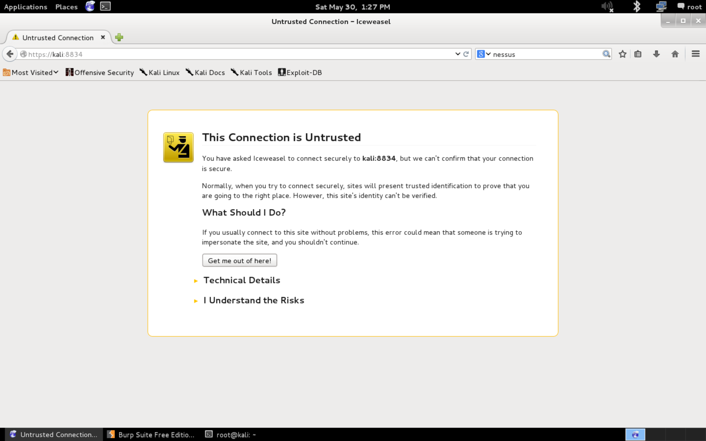
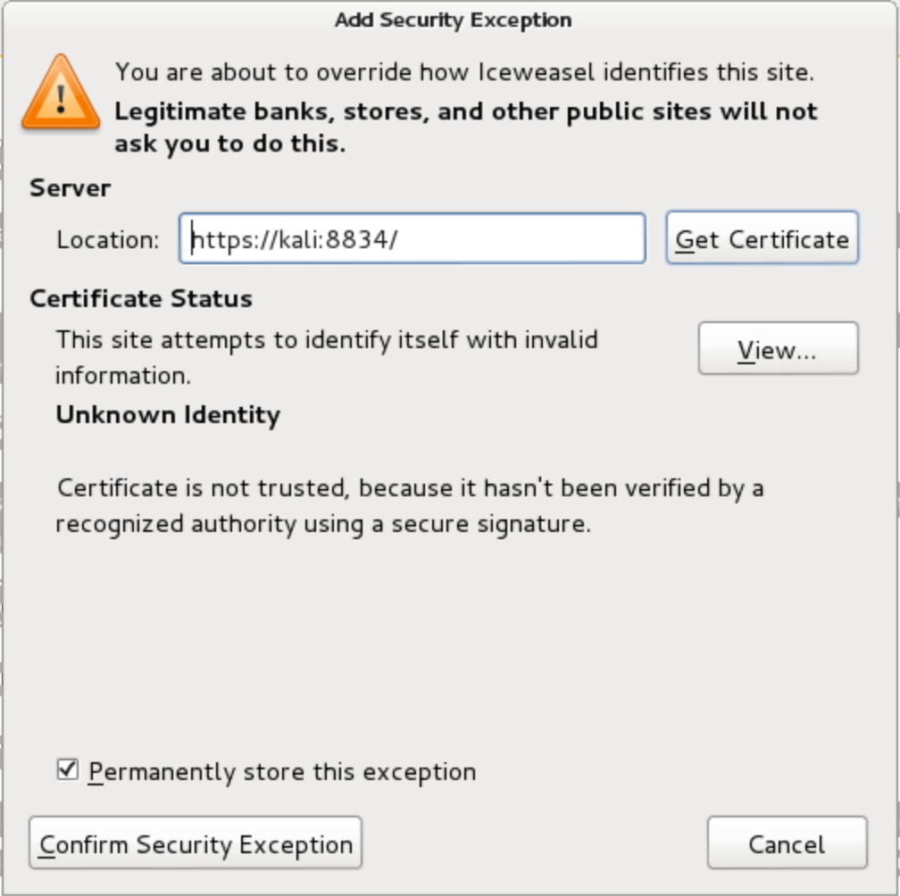

### Ek yazılım

* Nessus
* The Ming C Compiler
* Hyperion
* Veil-Evasion
* Ettercap
* Android Emulator
* Smartphone Pentest Framework


#### Nessus Kurulumu

Kali Linux denemelerimiz için lazım olan nerdeyse tüm araç-gereçleri içerse bile, ek olarak bazı proğramları kurmaya ihtiyaç duyabiliyoruz. İlk önce Tenable Security'nin güvenlik açıklarını taramak için yarayan Nessus Home programını kuracağız. Bu versiyonu sitesinde de göreceğiniz gibi basit bir çalışmalar için olup, bazı sınırlandırmaları vardır.

1. __Applications > Internet > Iceweasel Web Browser__ açalım ve http://www.tenable.com/products/nessus-home/ adresini girelim.

2. Üye formunu dolduralım ve __Register__ yaparak üye olalım. Mail adresimize _Activation Code_ göndereceğinden gerçek mail girelim.

3. İndirme sayfasına erişince Nessus'un Linux Debian 32 veya 64 bit platformu için son sürümünü `root` dizinimize indirelim. ()  
    32 bitm mi 64 bitmi? öğrenmek için __Applications > System Tools > System Monitor > System__

4. Linux terminal'ini açalım. `ls` yazdığımızda, yeni indirdiğimiz dosyayı görmemiz lazım.

5. `dpkg -i [indirdiğimiz_dosya_ismi]` yazarak __Enter__ basalım. Dosyanın ilk harfini yazarak, TAB tuşuna bastığmızda kendisi zaten bulacaktır. Karşılaşacağımız ekran:  
    ```ShellSession
    Selecting previously unselected package nessus.
    (Reading database ... 355024 files and directories currently installed.)
    Unpacking nessus (from Nessus-5.2.5-debian6_amd64.deb) ...
    Setting up nessus (5.2.5) ...
    nessusd (Nessus) 5.2.5 [build N25109] for Linux
    Copyright (C) 1998 - 2014 Tenable Network Security, Inc

    Processing the Nessus plugins...
    [###########    
    ```

6. Nessus kurulumu hatasız tamamlandığı zaman, aşağıdaki mesajı alacaksınız:  
    ```ShellSession
    All plugins loaded
    Fetching the newest plugins from nessus.org...
    Fetching the newest updates from nessus.org...
    Done. The Nessus server will start processing these plugins within a
    minute
    nessusd (Nessus) 5.2.5 [build N25109] for Linux
    Copyright (C) 1998 - 2014 Tenable Network Security, Inc

    Processing the Nessus plugins...
    [##################################################]

    All plugins loaded
    - You can start nessusd by typing /etc/init.d/nessusd start
    - Then go to https://kali:8834/ to configure your scanner
    ```

7. Nessus'u başlatmak için:  
    ```ShellSession
    root@kali:~# /etc/init.d/nessusd start
    ```

8. Iceweasel tarayıcısını açalım ve https://kali:8834/ adresine gidelim. _SSL certificate_ uyarısını alacaksınız:  


9. __I Understand the Risks__ ve sonrasında __Add Exception__ basalım, sonra ise __Confirm Security Exception__  


10. Nessus sayfası açılınca __Continue__ basalım, sonra __Initial Account Setup__ gelecektir karşımıza, kullanıcı adı ve şifremizi girerek devam edelim. 

11. Bu sayfada, bizden Nessus web sitesine üye olurken girdigimiz mail adrese göndereceği _activation code_ istiyor. 

12. Giriş tamamlandıktan sonra, Nessus eklentilerini indirecektir, biraz zaman alabilir.

Kurulum bitiminde karşımıza giriş penceresi gelecek, ve önceden girmiş olduğumuz kullanıcı adı ve parolayla giriş yapabileceğiz. Tamamladıktan sonra Nessus penceresini kapatalım. Bu program ilerdeki konularımızda lazım olacaktır.

#### Ming C Compiler

C kodlarını derleyip Windows sistemlerinde çalıştırabilmemiz için derleyiciye ihtiyacımız olacaktır. _Ming_ derleyicisi Kali'nin depolarında bulunmakta, ancak varsayılan olarak kurulmamıştır. Onun için:

```ShellSession
root@kali:~# apt-get install mingw32
```

#### Hyperion

Hyperion şifreleme programını antivirüs programlarını atlatmak için kullanacağız. _Ming_ gibi Kali'nin depolarında yoktur, `wget` ile indirmemiz, arşivden çıkarmamız, sonrasında ise Ming ile derlememiz lazımdır.

```ShellSession
root@kali:~# wget https://raw.githubusercontent.com/nullsecuritynet/tools/master/binary/hyperion/release/Hyperion-1.2.zip

root@kali:~# unzip Hyperion-1.0.zip
Archive: Hyperion-1.0.zip
creating: Hyperion-1.0/
creating: Hyperion-1.0/FasmAES-1.0/

root@kali:~# i586-mingw32msvc-c++ Hyperion-1.0/Src/Crypter/*.cpp -o hyperion.exe --snip--
```

#### Veil-Evasion

Veil-Evasion, genel antiwirüs çözümlerini atlatmak için payload oluşturmaya yarayan araçtır. İlk önce `wget` ile indirmemiz lazım. Sonra indirilen dosyası arşivden açıyoruz, sonra _Veil-master/setup_ dizinine değiştiriyoruz. Son olarak ta `./setup.sh` ile kurulumunu çalıştırıyoruz.

```ShellSession
root@kali:~# wget https://github.com/Veil-Framework/Veil-Evasion/archive/2.20.2.zip
--2015-11-26 09:54:10-- https://github.com/ChrisTruncer/Veil/archive/master.zip 
--snip--
2015-11-26 09:54:14 (880 KB/s) - `master.zip' saved [665425]

root@kali:~# unzip master.zip
Archive: master.zip 
948984fa75899dc45a1939ffbf4fc0e2ede0c4c4
    creating: Veil-Evasion-master/ 
--snip--
    inflating: Veil-Evasion-master/tools/pyherion.py

root@kali:~# cd Veil-Evasion-master/setup root@kali:~/Veil-Evasion-master/setup# ./setup.sh 
=========================================================================
[Web]: https://www.veil-evasion.com | [Twitter]: @veilevasion 
=========================================================================

[*] Initializing Apt Dependencies Installation --snip—
Do you want to continue? [Y/n]? Y
--snip--
root@kali:~#
```

#### Ettercap


