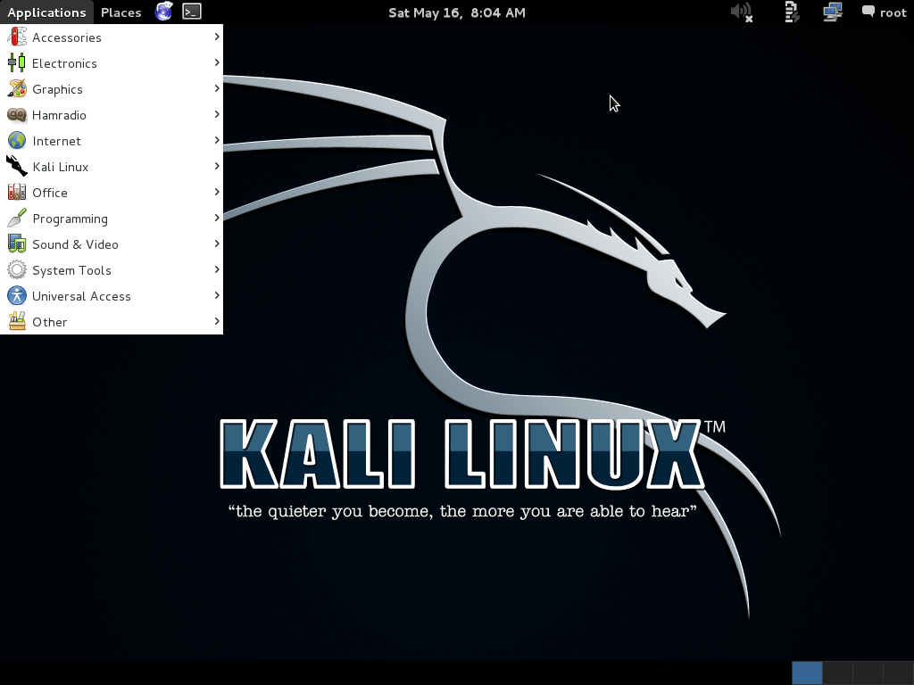

### Kali Linux nedir ?

* Kali bir Debian tabanlı Linux dağıtımıdır.
* Güvenlik testleri gerçekleştiren pentest, audit ekiplerinin kullanabileceği offensive security araçlarını bünyesinde barındırır.
* Penetrasyon test araçlarını içerir. Yoksa hepsini teker teker kurmak gerçek bir başağrısı olmakla beraber, büyük bir zaman kaybıdır.
* Kali Linux iki farklı şekilde kullanılabilir;
    1. Hazır CD den çalıştırma yolu ile
    2. Hard Disk'e kurulum, VMware aracılığı ile

* CD den çalıştırma yönteminin performansı cd okuyucunun hızına bağlıdır. Tavsiye edilen yöntem; Kali' yi diske kurmak veya sanallaştırma platformlarında çalıştırmak.
* Masaüstü ortamı olarak BackTrack'teki gibi KDE seçeneği yoktur, yalnızca GNOME masaüstü ortamı kullanılabilir durumdadır.
* Masaüstü kullanarak erişilebilecek proğramların çoğu, komut satırından çalışan program haline getirilmiştir.
* İndirme linki [http://www.kali.org/downloads/](http://www.kali.org/downloads/)
* [Wikipedia](http://tr.wikipedia.org/wiki/Linux)

