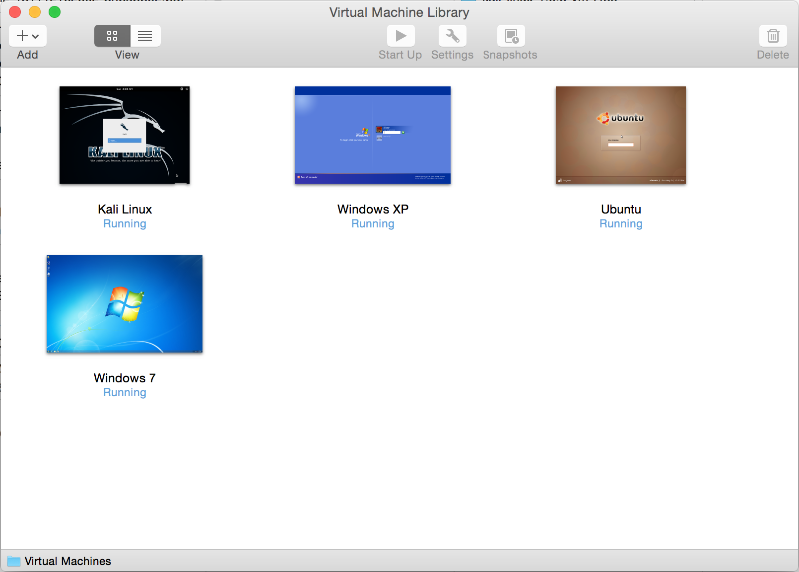

### VMware nedir ?

* __VMware__ bir sanallaştırma yazılımıdır.
* İştetim sistemlerini fiziksel makinelere kurmak yerine, __VMware__ aracılığı ile sanal olarak kurulabilir ve sanal network oluşturabilirsiniz.

VMware ve VirtualBox amaçları aynı, iki farklı proğramlardır. Hızlı bir araştırma sonrası VMware diğerine göre daha hızlı çalıştığını öğrendim. O yüzden biz genelde VMware ile devam edeceğiz, seçenek sizin. Mac kullanıcısı iseniz __VMware Fusion__ ücretli versiyonu bulunmaktadır, 30 günlük deneme süresini tercih edebilirsiniz.

İndirme linki:
* [VMware (Windows)](www.vmware.com/go/downloadplayer)
* [VMware Fusion (Mac)](http://www.vmware.com/products/fusion)

### VMware Kurulumu

VMware kullanıcılarına kolaylık; [Torrent](http://www.utorrent.com/) kuralım ve [bu linkten](http://www.nostarch.com/download/kali-linux-1.0.6-vm-i486.torrent) hazır kurulmuş Kali'mizi indirelim. Sonradan tıkla çalıştır. Herhangi bir sebeple çalışmadığı halde, VirtualBox için gösterdiğimiz gibi kolayca Kali indirirek, kendiniz de oluşturabilirsiniz.

Usename: `root`
Password: `toor`